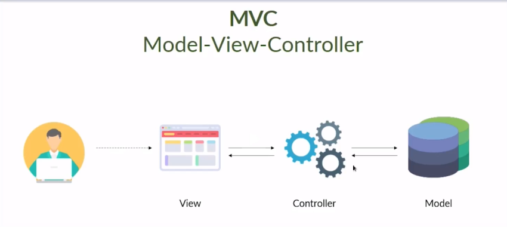

# Architecture MVC Study



## Sobre o Repositório

Este repositório contém um projeto de estudo sobre a arquitetura MVC (Model-View-Controller), implementado através de uma API para gerenciar a adoção de pets. O projeto inclui funcionalidades para registro de adoções, listagem de pets disponíveis, exclusão de pets e visualização de informações de adoções realizadas.

## Funcionalidades

### 1. Registro de Adoção
Neste módulo, o usuário pode registrar uma adoção, vinculando uma pessoa a um pet. O foco é garantir que cada adoção seja associada a um registro específico, utilizando o padrão MVC para separar a lógica de controle, visualização e modelo de dados.


### 2. Listagem de Pets
Esta funcionalidade permite listar todos os pets disponíveis para adoção. Demonstra a aplicação da camada de controle e modelo na recuperação e exibição dos dados.


### 3. Exclusão de Pets
Implementação da funcionalidade de deletar um pet do sistema. Mostra como o padrão MVC organiza a exclusão de dados e a interação entre o controlador e o modelo.

### 4. Informações de Adoção
O usuário pode visualizar as informações de uma pessoa junto com o pet que ela adotou. Esta funcionalidade explora a integração das camadas MVC para consultar e exibir dados de adoções específicas.


## Como Usar

1. Clone o repositório:
   ```bash
   git clone https://github.com/devGabyAlves/architecture-mvc-study.git

2. Navegue até o diretório do projeto:
   ```bash
   cd architecture-mvc-study

3. Instale as dependências do projeto:
    pip install -r requirements.txt

4. Execute a aplicação:
    python run.py

## Contribuição

Sinta-se à vontade para contribuir com melhorias ou novos exemplos para este repositório. Você pode abrir uma issue ou enviar um pull request.

## Licença

Este projeto está licenciado sob os termos da MIT License.
